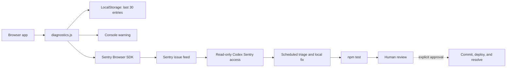

# Sentry Integration and Scheduled Repair Playbook

This document explains the Sentry implementation in Quiz Control and turns it
into a reusable pattern for another browser-based project. It covers runtime
error capture, privacy controls, deployment behavior, read-only issue intake,
and a review-gated Codex repair loop.

The reference implementation was reviewed on August 15, 2026.

## What this implementation does

Quiz Control has two complementary observability paths:

1. Browser failures are kept locally so the app remains diagnosable even when
   Sentry is unavailable.
2. When a public Sentry DSN is configured, the same failures are sent to a
   Sentry Browser JavaScript project with limited context and no default PII.

A separate Codex automation can read Sentry issues on a schedule, compare them
with the local repository, make narrowly scoped fixes, run tests, and return a
report for review. It does not deploy code or resolve issues in Sentry.



## Current Quiz Control configuration

| Concern | Implementation |
| --- | --- |
| Sentry organization | `ead-ot` |
| Sentry project | Browser JavaScript project, slug `javascript` |
| Project ID | `4511898598834176` |
| Issue feed | `https://ead-ot.sentry.io/issues/?project=4511898598834176` |
| Browser SDK | `@sentry/browser@10.18.0`, loaded from `esm.sh` |
| Runtime configuration | `config.js` exposes `window.QUIZ_PLATFORM_CONFIG.sentryDsn` |
| Shared diagnostics module | `diagnostics.js` |
| Quiz runner integration | `app.js` |
| Authoring integration | `author.js` |
| Production packaging | `prepare-deploy.mjs` copies `diagnostics.js` and `config.js` |
| Automated verification | `npm test` |

The actual DSN is intentionally not repeated here. A browser DSN is a public
ingestion identifier, not an administrative credential, but each receiving
project should use its own DSN and quota controls.

## Browser instrumentation

### Runtime configuration

`config.js` contains the browser-safe configuration object and the public DSN:

```js
window.QUIZ_PLATFORM_CONFIG = {
  // Other public browser configuration...
  sentryDsn: "https://PUBLIC_KEY@ORG.ingest.sentry.io/PROJECT_ID"
};
```

Both `index.html` and `author.html` load `config.js` before their module entry
point. That ordering lets `diagnostics.js` read the configuration during app
startup.

The local Node development server is intentionally different: its generated
`/config.js` response does not include `sentryDsn`. Local development therefore
uses local logs only. Production packaging copies the repository's `config.js`
into `.deploy-assets`, enabling Sentry in the deployed Cloudflare asset bundle.

### Initialization

`startDiagnostics(scope)` is called once from each browser surface:

- `app.js` passes the active view, such as `host`, `player`, or `presenter`.
- `author.js` passes `author`.

When a DSN exists, `diagnostics.js` dynamically imports the pinned Browser SDK
and initializes it with:

```js
Sentry.init({
  dsn,
  environment: location.hostname === "localhost" ? "development" : "production",
  sendDefaultPii: false,
  beforeSend(event) {
    delete event.user;
    return event;
  }
});
```

The import is deliberately non-blocking. A CDN or SDK failure emits a console
warning but cannot stop a quiz or authoring session.

`startDiagnostics` also registers browser-level handlers for:

- uncaught `error` events; and
- unhandled promise rejections.

### Explicit operational errors

Expected failure boundaries call `recordDiagnostic(scope, error, context)`.
Examples include:

- hosted-room connection and host-state persistence;
- answer submission and automatic answer submission;
- question locking and scoring;
- anonymous answer-wall refreshes;
- between-round door choices and reward reveal;
- question-bank loading, author sign-in, and quiz publishing.

Stable scope tags such as `submit-answer`, `lock-and-score`, and
`publish-quiz` make Sentry grouping and filtering more useful than a generic
"request failed" message.

### Local fallback

Every recorded failure is also:

- sanitized by `safe()`;
- appended to `localStorage` under `quiz-control:diagnostics:v1`;
- capped at the 30 most recent entries; and
- written to the console.

The UI can export the retained entries as `quiz-control-diagnostics.json` for
support. Local persistence is wrapped in `try/catch`, so storage denial, quota
errors, or malformed historical data cannot interrupt the application.

## Privacy and credential boundaries

Keep these two Sentry values conceptually separate:

| Value | Exposure | Purpose |
| --- | --- | --- |
| Browser DSN | Public/browser-safe | Lets the Browser SDK submit events to one Sentry project |
| `SENTRY_AUTH_TOKEN` | Secret | Lets tools read issues and events through the Sentry API |

Never place `SENTRY_AUTH_TOKEN` in browser configuration, source control, a
prompt, or a chat message. Set it locally or in an approved secret manager.
For read-only triage, use only the scopes needed by the integration, typically
`project:read`, `event:read`, and `org:read`.

Current privacy protections are useful but not exhaustive:

- `sendDefaultPii` is disabled.
- `beforeSend` removes `event.user`.
- Top-level context keys matching secret, token, authorization, API key, or
  password are removed.
- Context strings are truncated to 300 characters.
- Locally retained `Error` stacks are limited to four lines.

The sanitizer is shallow. Nested objects, URLs, breadcrumbs, error messages,
and browser-provided metadata can still contain sensitive values. A project
handling personal, medical, financial, student, or employee data should add a
recursive allowlist-based scrubber and inspect sample events before enabling
production reporting.

## Scheduled Codex workflow used here

Quiz Control has a bounded six-run pilot named **Six-day Sentry fix trial**.
It runs at 9:00 AM Eastern from August 16 through August 21, 2026. The final run
asks whether the workflow should continue; it does not renew itself.

Each run is instructed to:

1. Read new or unresolved issues from the Quiz Control Sentry project.
2. Review event context, frequency, release information, and local source.
3. Group duplicate reports.
4. Check the working tree and existing fixes before editing.
5. Implement only minimal, high-confidence fixes that do not overwrite user
   work.
6. Add focused tests when appropriate and run `npm test`.
7. Report inspected issues, changed files, test results, and unresolved risks.

The automation is explicitly prohibited from committing, pushing, deploying,
resolving Sentry issues, or changing external data. Those remain human review
steps.

The scheduled task is stored by the desktop app rather than in this repository.
For another project, recreate it from that project's task after validating an
on-demand triage run. OpenAI's documented workflow similarly recommends tuning
manual bug triage before scheduling it and keeping external follow-up actions
reviewable:

- [Automate bug triage](https://learn.chatgpt.com/use-cases/automation-bug-triage)
- [Scheduled tasks](https://learn.chatgpt.com/docs/automations)

### Authentication prerequisite

Installing the Sentry plugin supplies the read-only workflow, but API access
still requires authentication. In environments that use the bundled Sentry API
script, set `SENTRY_AUTH_TOKEN` locally before the first run. Do not paste the
token into chat. The token is not currently configured in this repository's
shell environment, so an unattended run must either receive it through the
approved local environment or use an authenticated connector supplied by its
host application.

The bundled read-only integration uses Sentry `GET` endpoints for issue lists,
issue details, issue events, and event details. It does not need permission to
resolve or mutate issues.

### Reusable scheduled-task prompt

Adapt this prompt after a successful manual run:

> Use read-only Sentry access to inspect new or unresolved issues for
> `[organization/project]` since the previous run. Review event context,
> frequency, release information, and the local repository. Group duplicates
> and keep observed evidence separate from inference. Before editing, inspect
> the working tree and existing changes. Implement only minimal,
> high-confidence fixes that can be verified locally and do not overlap user
> work. Add focused tests where appropriate and run the project's standard test
> command. Do not commit, push, deploy, resolve Sentry issues, or change
> external data. Report issues inspected, files changed, test results, risks,
> and anything requiring review. If Sentry access is unavailable, report the
> authentication problem and stop.

For a busy or shared repository, run code-changing automation in an isolated
Git worktree. A read-only triage task can safely run more frequently than a
fixing task.

## Porting checklist

### 1. Create and identify the Sentry project

- Create a Sentry project for the correct runtime, such as Browser JavaScript.
- Record the organization slug, project slug, project ID, and issue URL.
- Copy the project's public DSN into browser-safe runtime configuration.
- Do not reuse Quiz Control's DSN in another application.

### 2. Install and pin the SDK

This repository uses a pinned dynamic CDN import because it ships unbundled
browser modules. A bundled project should normally install `@sentry/browser`
through its package manager and pin or lock the dependency in its normal build.
Keep SDK initialization early enough to capture startup failures, but make sure
observability cannot prevent the application from starting.

### 3. Add a small diagnostics boundary

Provide three operations:

```js
startDiagnostics(surfaceName);
recordDiagnostic(stableScope, error, allowlistedContext);
downloadDiagnostics(); // Optional support feature
```

Keep the application-facing API vendor-light. That makes it possible to retain
local diagnostics or replace Sentry without rewriting every error boundary.

### 4. Instrument meaningful failure boundaries

Capture failures where the application can add operational context: request
type, non-sensitive entity IDs, UI surface, retry stage, or feature name. Avoid
capturing expected validation failures and normal race conditions as errors.
The Quiz Control answer-submission path, for example, suppresses a known stale
question race before it becomes a rejected RPC and noisy Sentry issue.

### 5. Define privacy rules before launch

- Prefer allowlisted context over arbitrary object capture.
- Exclude passwords, tokens, authorization headers, private content, and raw
  request or response bodies.
- Decide whether room IDs, customer IDs, email addresses, IP addresses, query
  strings, and filenames are allowed.
- Set an event-retention policy for both Sentry and any local fallback.
- Trigger controlled test errors and inspect the complete received event.

### 6. Separate browser and server instrumentation

This implementation covers only browser JavaScript. It does not instrument the
Node development server, Cloudflare Worker request handlers, Supabase database,
or video-processing Worker. Add runtime-specific Sentry initialization to those
components if their server-side failures need first-class reporting.

### 7. Add releases and source maps when needed

Quiz Control currently deploys readable browser modules and does not set a
Sentry `release`. If a target project bundles or minifies JavaScript, add a
release identifier and upload matching source maps before the release receives
events. Sentry uses releases to associate errors with deployed versions and for
source-map/debug features:

- [Sentry release API](https://docs.sentry.io/api/releases/create-a-new-release-for-an-organization/)
- [Sentry source-map guidance](https://docs.sentry.io/platforms/javascript/guides/tanstackstart-react/sourcemaps/uploading/esbuild)

Keep source-map upload credentials in CI secrets, never in shipped browser
assets.

### 8. Verify the integration

In a non-production environment or controlled test route:

1. Trigger one handled exception through `recordDiagnostic`.
2. Trigger one unhandled promise rejection.
3. Confirm the app remains usable.
4. Confirm local diagnostics retain both events.
5. Confirm Sentry receives the correct environment and stable scope tag.
6. Inspect the full Sentry payload for private data.
7. Verify a failed SDK import leaves only a local warning.
8. Verify the standard test suite still passes.

### 9. Pilot automation conservatively

- Start with read-only triage.
- Tune duplicate grouping, priority rules, and evidence requirements manually.
- Add local fixes only after the reports are reliable.
- Require tests for every code change.
- Keep commit, push, deploy, issue resolution, and team notifications behind
  explicit review.
- Use a short trial with an explicit continuation decision.

## Known gaps in the reference implementation

- No Sentry release identifier or deploy association is configured.
- No source-map upload pipeline exists; this matters if the app becomes bundled
  or minified.
- No server-side or Cloudflare Worker Sentry SDK is initialized.
- The browser SDK is fetched at runtime from a third-party CDN.
- Sanitization is shallow rather than recursively allowlist-based.
- Local diagnostics have a count cap but no time-based expiration.
- There is no dedicated automated test for `diagnostics.js` sanitization,
  storage capping, or SDK-failure behavior.
- The local development server deliberately omits the Sentry DSN.
- The read-only Sentry API token still needs to be configured for unattended
  local automation.

These gaps are not all defects. They document the current tradeoffs so another
project can decide which controls its risk profile and build system require.

## Recommended next improvements

For Quiz Control or a similar production application, the highest-value next
steps are:

1. Add unit tests for recursive redaction, storage limits, and failed SDK load.
2. Replace shallow context filtering with an allowlist-based recursive scrubber.
3. Add release metadata tied to the deployed commit or Cloudflare version.
4. Add server/Worker instrumentation for failures that never reach the browser.
5. Move from runtime CDN loading to the normal package/build pipeline if the
   project adopts bundling.
6. Review the six-run automation pilot before choosing a permanent cadence or
   expanding its authority.

